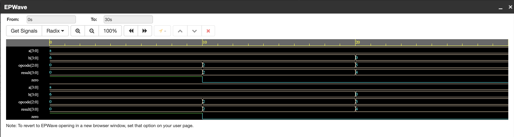
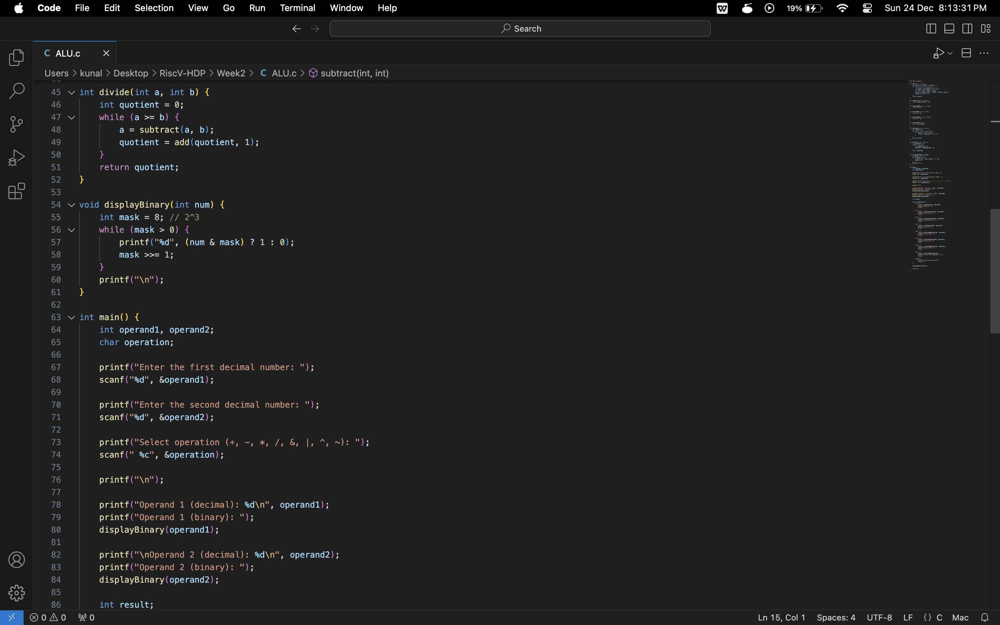
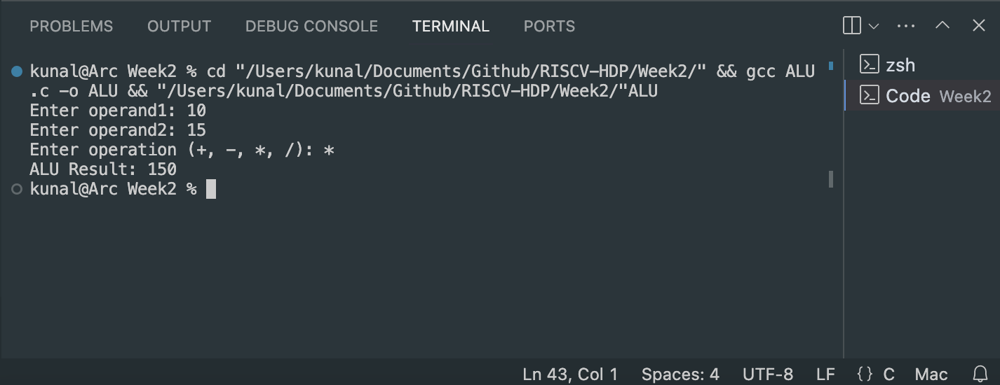
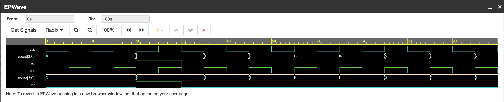

 

__________________________________________

Solution 1.
Calculation: 10 - 19 (base 10)

Decimal Representation:
- 10 = 00001010
- 19 = 00010011

1s Complement of 19:
- 1s complement(19) = 11101100

2s Complement of 19:
- 2s complement(19) = 11101101

Addition of 10 and -19:
- 10 + (-19) = 11110111

1s Complement of the Result:
- 1s complement(11110111) = 00001000

2s Complement of the Result:
- 2s complement(11110111) = 00001001

Final Result:
- -9 = 00001001

---

Calculation: 20 + 30 (base 10)

Decimal Representation:
- 20 = 00010100
- 30 = 00011110

Addition of 20 and 30:
- 20 + 30 = 00110010

Final Result:
- 50 = 00110010

---

Calculation: 36 - 12 

Decimal Representation:
- 36 = 00100100
- 12 = 00001100

1s Complement of 12:
- 1s complement(12) = 11110011

2s Complement of 12:
- 2s complement(12) = 11110100

Addition of 36 and -12:
- 36 + (-12) = 11110100

Final Result:
- -12 = 11110100

__________________________________________
Solution 2.

4-bit ALU:

Result:

__________________________________________
Solution 3.

4-bit ALU code in Verilog
Output:

Faced an error on MacOS 14:
