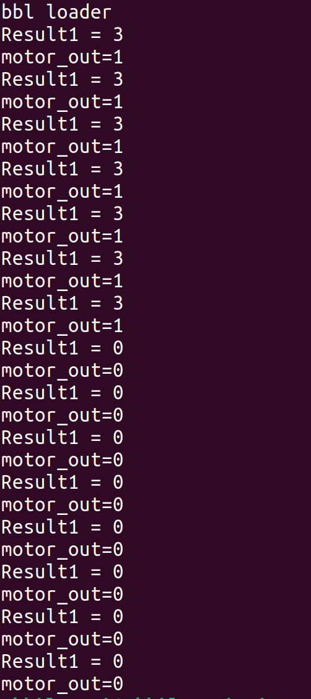

 


# Temperature-Activated Motor Sprinkler System

This project implements a simple temperature-activated motor pump system using a custom RISC-V processor with I/O-mapped GPIO. The system reads temperature data from a sensor and activates an motor (LED and pump) when the temperature exceeds a predefined threshold.

## Hardware Setup

- The RISC-V processor is configured with I/O-mapped GPIO addresses.
- A temperature sensor is connected to the system, and its data is read from the address `0x20000000`.
- The LED and buzzer are connected to GPIO pins, with their respective pin numbers defined in the code.

## Software Implementation

The main C code (`main.c`) continuously reads the temperature from the sensor and activates the fire alarm if the temperature exceeds a predefined threshold. The alarm is indicated by turning on an LED and a buzzer.

## Compilation and Execution

1. Compile the C code using a RISC-V toolchain. Example:

   riscv32-unknown-elf-gcc -O0 -ggdb -nostdlib -march=rv32i -mabi=ilp32 -Wl,-Tmain.ld main.c -o main.elf


C code:

```
#include <stdio.h>
#include <stdlib.h>

int main() {
    int flag;
    int flame;
    int motor = 0;
    int motor_reg = motor * 4;
    int led = 0;
    int led_reg = led * 8;
    int mask = 0xFFFFFFF3;

    asm volatile(
        "and x30, x30, %2\n\t"
        "or x30, x30, %0\n\t"
        "or x30, x30, %1\n\t"
        :
        : "r"(motor_reg), "r"(led_reg), "r"(mask)
        : "x30"
    );

    while (1) {
        asm volatile(
            "andi %0, x30, 1\n\t"
            : "=r"(flag)
            :
            :
        );

        if (flag) {
            asm volatile(
                "andi %0, x30, 2\n\t"
                : "=r"(flame)
                :
                :
            );

            if (flame == 0) {
                motor = 1;
                led = 1;
            } else {
                motor = 0;
                led = 0;
            }

            motor_reg = motor * 4;
            led_reg = led * 8;

            asm volatile(
                "and x30, x30, %2\n\t"
                "or x30, x30, %0\n\t"
                "or x30, x30, %1\n\t"
                :
                : "r"(motor_reg), "r"(led_reg), "r"(mask)
                : "x30"
            );
        }
    }

    return 0;
}
```


Assembly Code:


```a


Disassembly of section .text:

00010054 <main>:
   10054:	fd010113          	addi	sp,sp,-48
   10058:	02812623          	sw	s0,44(sp)
   1005c:	03010413          	addi	s0,sp,48
   10060:	fec42783          	lw	a5,-20(s0)
   10064:	00ff6f33          	or	t5,t5,a5
   10068:	001f7793          	andi	a5,t5,1
   1006c:	fef42423          	sw	a5,-24(s0)
   10070:	fec42783          	lw	a5,-20(s0)
   10074:	02078663          	beqz	a5,100a0 <main+0x4c>
   10078:	ffd00793          	li	a5,-3
   1007c:	fef42223          	sw	a5,-28(s0)
   10080:	00100793          	li	a5,1
   10084:	fef42023          	sw	a5,-32(s0)
   10088:	fe442783          	lw	a5,-28(s0)
   1008c:	00ff7f33          	and	t5,t5,a5
   10090:	002f6f13          	ori	t5,t5,2
   10094:	000f0793          	mv	a5,t5
   10098:	fcf42e23          	sw	a5,-36(s0)
   1009c:	fc5ff06f          	j	10060 <main+0xc>
   100a0:	ffd00793          	li	a5,-3
   100a4:	fef42223          	sw	a5,-28(s0)
   100a8:	fe042023          	sw	zero,-32(s0)
   100ac:	fe442783          	lw	a5,-28(s0)
   100b0:	00ff7f33          	and	t5,t5,a5
   100b4:	000f6f13          	ori	t5,t5,0
   100b8:	000f0793          	mv	a5,t5
   100bc:	fcf42e23          	sw	a5,-36(s0)
   100c0:	fa1ff06f          	j	10060 <main+0xc>


```


Spike Output:





Number of different instructions: 10

List of unique instructions:
 
```a

1)  addi
2)  sw
3)  lw
4)  andi
5)  beq
6)  ori
7)  li
8)  j
9)  mv 
10) ori

```

