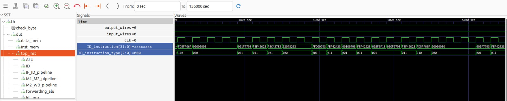
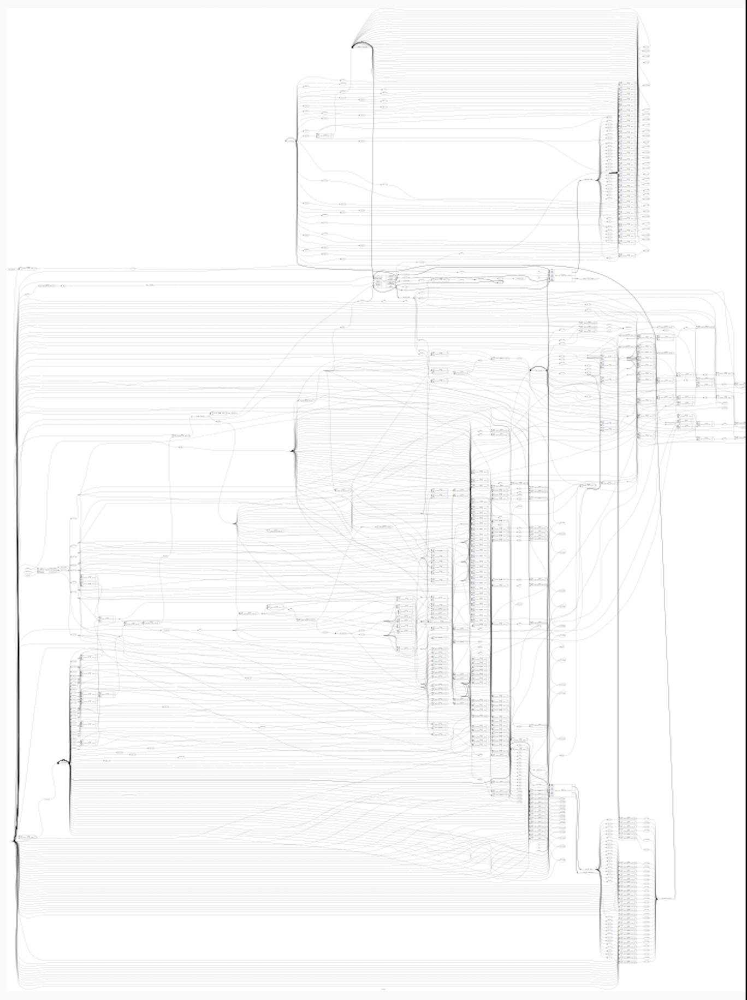

# Sky130 RTL Synthesis for RISC-V 

## Overview:

This repository provides an overview of the synthesis process for RTL (Register-Transfer Level) code using the SkyWater 130nm (Sky130) process and the Yosys tool for RISC-V designs.

## Steps:

### 1. RTL Design:

- Begin with RTL code written in a hardware description language (HDL) like Verilog or VHDL.
- Describe digital logic and behavior at the register-transfer level.

### 2. Synthesis Tool (Yosys):

- Use Yosys, an open-source synthesis tool, to generate a gate-level netlist from the RTL code.
- The netlist represents the design using basic logic gates, flip-flops, and standard cells.

### 3. Technology Mapping:

- Yosys performs technology mapping, mapping the netlist to specific library cells available in the Sky130 process.
- Choose appropriate standard cells matching RTL functionality.

### 4. Cell Library (Libraries):

- Utilize the Sky130 standard cell library, which includes logic gates, flip-flops, and other cells.
- Yosys maps RTL logic to specific cells using this library.

### 5. Timing Constraints:

- Specify timing constraints (clock frequency, setup/hold times) to ensure the design meets performance requirements.
- Yosys considers these constraints during synthesis.

### 6. Netlist Optimization:

- Yosys optimizes the netlist to enhance performance, reduce power consumption, and minimize area utilization.
- Optimization includes logic restructuring and removal of redundant elements.

### 7. Post-Synthesis Simulation:

- Conduct post-synthesis simulation to verify that the synthesized netlist behaves as expected.
- Identify and address any issues introduced during synthesis.

### 8. Formal Verification:

- Employ formal verification tools to ensure the synthesized netlist adheres to original design specifications and meets specific properties.

### 9. Place and Route:

- After synthesis and verification, perform place and route using tools like OpenROAD.
- Determine the physical placement of cells and routing of interconnections on the chip.

### 10. GDSII Generation:

- Generate the GDSII file, the layout description of the chip, for fabrication.

### 11. Foundry Submission:

- Submit the GDSII file to the foundry for fabrication.
- The foundry uses the GDSII file to create masks for manufacturing the chip.

## Usage:

- Clone this repository for a detailed guide on synthesizing RTL code using Sky130 and Yosys for RISC-V designs.

- Follow the step-by-step instructions provided in the documentation.


# Installing Yosys on the VSDWorkshop VM

## Overview:

This guide explains how to install Yosys on the VSDWorkshop VM. Note that Yosys is pre-installed on the VSDWorkshop VM, so you don't need to perform any additional installations.

To verify if Yosys is installed, you can open a terminal on the VSDWorkshop VM and run the following command:

```bash
yosys -h

```

## Gate Level Synthesis - GLS
-- Comment out the data & instruction memory modules in processor.v and ensure writing_inst_done=1 for uart verification OR writing_inst_done=0 to bypass uart for simulation.\
-- All required ```sky130``` libs are kept in the current working directory, and proper instantiation name is used for **SRAM** from sky130 libs.\

### Use the following yosys commands to synthesize gate-level netlist
```
yosys
```
--  make sure you have latest version of yosys 


-- Read liberty file to import sky130 cells
```
read_liberty -lib sky130_fd_sc_hd__tt_025C_1v80_256.lib
```
-- Read your verilog file and generate RTLIL\
NOTE : RTLIL of sky130 sram cell should be generated as it is not part of module design.
```
read_verilog gpio_syn.v
```


-- Synthesis of top module (wrapper)
```
synth -top wrapper
```


-- Mapping yosys standard cell to sky130 lib logic cells
```
abc -liberty sky130_fd_sc_hd__tt_025C_1v80_256.lib
```


-- Mapping sky130 lib flip-flop cells
```
dfflibmap -liberty sky130_fd_sc_hd__tt_025C_1v80_256.lib
```


# GTKWave Simulations


Validates that the synthesized netlist behaves correctly and consistently with the original RTL description.


# GLS (Gate Level Simulation) in Digital Design

GLS, which stands for "Gate Level Simulation," is a crucial step in digital design and verification. It involves simulating the behavior of the synthesized netlist, which is the gate-level representation of a design. This simulation is essential for ensuring that the logical functionality of the gate-level design aligns with the intended behavior described in the RTL (Register Transfer Level) design.

## Purpose of GLS:

Gate Level Simulation serves several key purposes in the digital design flow:

1. **Functional Verification:**
   - Validates that the synthesized netlist behaves correctly and consistently with the original RTL description.
   - Confirms that the logic gates and flip-flops in the gate-level netlist accurately represent the intended functionality.

2. **Timing Analysis:**
   - Evaluates and analyzes the timing characteristics of the design at the gate level.
   - Identifies and addresses any potential timing issues, ensuring that the design meets performance requirements.

3. **Power Analysis:**
   - Estimates power consumption based on the gate-level activities during simulation.
   - Helps optimize power usage for the design.

## Commands for Netlist Generation (Logic Synthesis):
```
show wrapper

```

 

